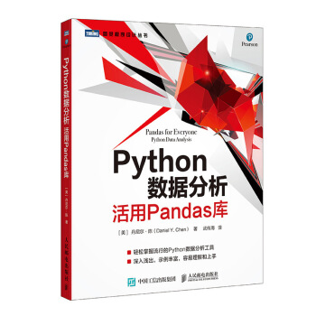

# Panadas 小书 

历史上我用过很多本 Pandas 习题集/图书

我们现在用这本书，我想根据这本书，写一本更好的小书！

## 第一章 Pandas DataFrame 基础知识

### [习题](01-dataframe-basic/questions.ipynb) --- [答案](01-dataframe-basic/answer-questions.ipynb)

* 学习开始读取本地的 Excel 文件
* 学习开始操作 DataFrame
* 了解索引(index) 的基础概念
* 这一章知识有点综合，想让大对 DataFrame 有一个全面的认识
* 这一次学不会，没关系，后面还会重复讲

## 第二章

### [习题](02-more-pandas/questions.ipynb) --- [答案](02-more-pandas/answer-questions.ipynb)

*

## 第四章

### [习题](04-concat-merge/questions.ipynb) --- [答案](04-concat-merge/answer-questions.ipynb)

*

## 第五章

### [习题](05-missing/questions.ipynb) --- [答案](05-missing/answer-questions.ipynb)

*

## 第六章

### [习题](06-tidy/questions.ipynb) --- [答案](06-tidy/answer-questions.ipynb)

*

## 第七章 数据类型转换

### [习题](07-data-type/questions.ipynb) --- [答案](07-data-type/answer-questions.ipynb)

* 如何处理混合数据类型的问题
* 如何处理 NA 不是空值的问题
* 如何处理客户错填的销量信息

## 第八章 字符串和文本数据

### [习题](08-string/questions.ipynb) --- [答案](08-string/answer-questions.ipynb)

* 如何去掉销售数据中的货币单位
* 如何从客户邮件中提取电话号码

